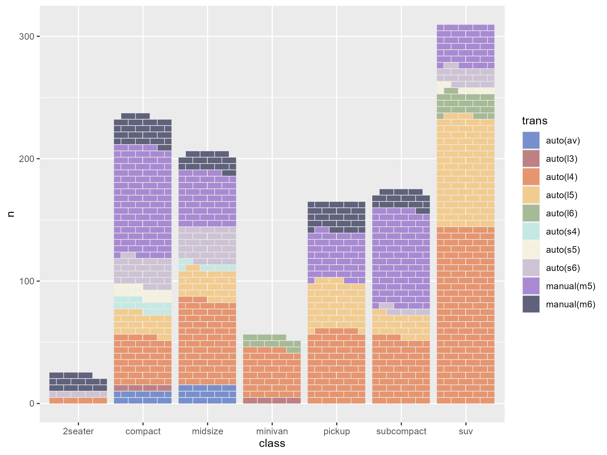

# ggbrick 

Create a 'waffle' style chart with the aesthetic of a brick wall.

Usage is similar to `geom_col` where you supply counts as the height of the bar. Each whole brick represents 1 unit. Two half bricks equal one whole brick. Where the count exceeds the number of brick layers, the number of bricks is scaled to retain the brick wall aesthetic.

## Installation

Install from Git

```{r, eval = FALSE}
devtools::install_github("doehm/ggbrick")
```

Simple example

```{r, eval = FALSE}

library(ggplot2)
library(ggbrick)

d10 <- c("#788FCE", "#BD8184", "#E6956F", "#F2CC8F", "#A6BA96", "#C5E8E3", 
         "#F4F1DE", "#CDC3D4", "#A88AD2", "#60627C")

mpg |>
  count(class, drv) |>
  ggplot() +
  geom_brick(aes(class, n, fill = drv)) +
  scale_fill_manual(values = d10)

```


The fill can be randomised to create a different look with `type = 'random'` or `type = 'soft_random'`.


In this case each brick represents a car (a row) in `mpg`. When the number of bricks gets too large, the number of brick layers will be capped and the number of bricks will be scaled down. The proportions of the fill aesthetic will be held consistent. This can be adjusted with the `brick_layers` parameter.

```{r, eval = FALSE}
mpg |>
  count(class, trans) |>
  mutate(n = 5*n) |>
  ggplot() +
  geom_brick(aes(class, n, fill = trans)) +
  scale_fill_manual(values = d10)
```



You can also adjust the number of bricks per layer with the `bricks_per_layer` parameter.

```{r, eval = FALSE}
ggplot() +
  geom_brick(aes(x = 1, y = 96), fill = "firebrick", bricks_per_layer = 8)
```


