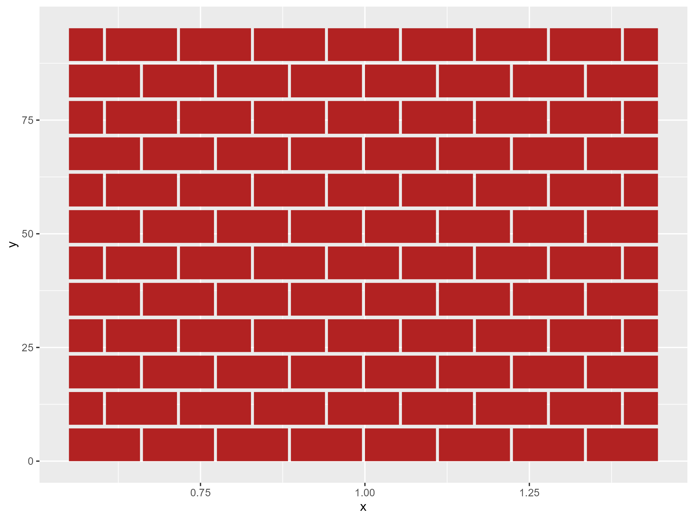

# ggbrick 

Create a 'waffle' style chart with the aesthetic of a brick wall.

Usage is similar to `geom_col` where you supply counts as the height of the bar and a `fill` for a stacked bar. Each whole brick represents 1 unit. Two half bricks equal one whole brick. 

## Installation

Install from Git

```{r, eval = TRUE, echo=FALSE}
library(ggplot2)
library(ggbrick)
suppressPackageStartupMessages(library(dplyr))

d10 <- c("#788FCE", "#BD8184", "#E6956F", "#F2CC8F", "#A6BA96", "#C5E8E3", 
         "#F4F1DE", "#CDC3D4", "#A88AD2", "#60627C")
```


```{r, eval = FALSE}
devtools::install_github("doehm/ggbrick")
```

Simple example

```{r, eval = FALSE}

library(ggplot2)
library(ggbrick)

d10 <- c("#788FCE", "#BD8184", "#E6956F", "#F2CC8F", "#A6BA96", "#C5E8E3", 
         "#F4F1DE", "#CDC3D4", "#A88AD2", "#60627C")

mpg |>
  count(class, drv) |>
  ggplot() +
  geom_brick(aes(class, n, fill = drv)) +
  scale_fill_manual(values = d10) +
  coord_brick()

```


The fill can be randomised to create a different look with `type = 'random'` or `type = 'soft_random'`.


In this case each brick represents a car (a row) in `mpg`. When the number of bricks gets too large, the number of brick layers will be capped and the number of bricks will be scaled down. The proportions of the fill aesthetic will be held consistent. This can be adjusted with the `brick_layers` parameter.

```{r, eval = FALSE}
mpg |>
  count(class, trans) |>
  mutate(n = 5*n) |>
  ggplot() +
  geom_brick(aes(class, n, fill = trans)) +
  scale_fill_manual(values = d10) +
  coord_brick()
```


You can also adjust the number of bricks per layer with the `bricks_per_layer` parameter.

```{r, eval = FALSE}
ggplot() +
  geom_brick(aes(x = 1, y = 96), fill = "firebrick", bricks_per_layer = 8)
```



You can control with width with `width`. To keep the right aspect ratio also use `coord_brick(width = 0.5)`

```{r, fig.width=14}
mpg |>
  count(class, drv) |>
  ggplot() +
  geom_brick0(aes(class, n, fill = drv), width = 0.5) +
  coord_brick(width = 0.5) +
  scale_fill_manual(values = d10)
```


## Waffle

To create a more familiar waffle chart you can use `geom_waffle0()` and `geom_waffle()`. `geom_waffle0()` is just `geom_waffle()` with `gap = 0`.

```{r, eval = TRUE, fig.width=14}
mpg |>
  count(class, drv) |>
  ggplot() +
  geom_waffle0(aes(class, n, fill = drv))+
  coord_waffle() +
  scale_fill_manual(values = d10)

mpg |>
  count(class, drv) |>
  ggplot() +
  geom_waffle(aes(class, n, fill = drv))+
  coord_waffle() +
  scale_fill_manual(values = d10)
```

To flip the coords you'll have to use `theme(aspect.ratio = x)` to maintain the brick aspect ratio (sqaure in the case of waffle)

```{r, fig.width=14}
mpg |>
  count(class, drv) |>
  ggplot() +
  geom_waffle0(aes(class, n, fill = drv)) +
  scale_fill_manual(values = d10) +
  coord_flip() +
  theme(
    aspect.ratio = 2
  )
```

